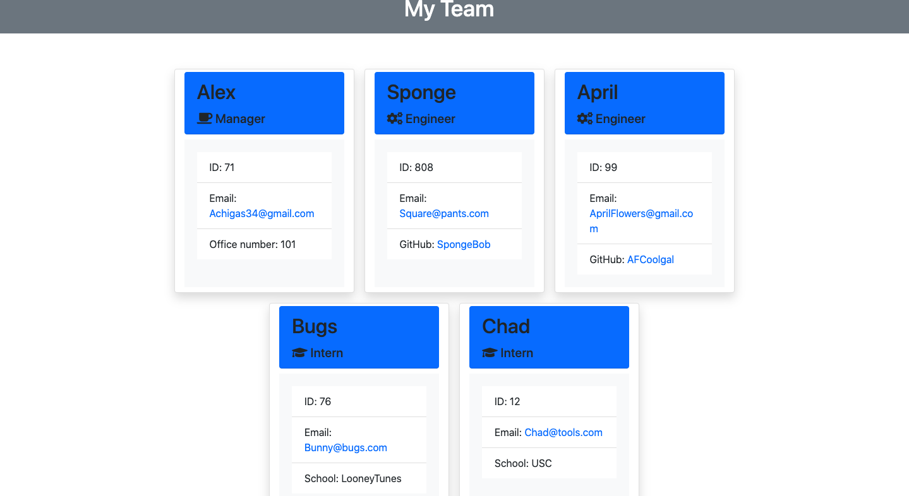

# Team Profile Generator 
> Quickly generate a team portfolio

## Table of contents
* [General info](#general-info)
* [Screenshots](#screenshots)
* [Video Walkthrough](#video_walkthrough)
* [Licenses](#technologies)
* [Setup](#setup)
* [Status](#status)
* [Inspiration](#inspiration)
* [Contact](#contact)

## General info
This project is used to create a team portfolio wiht links to emails, Githubs, and basic employee information. You will enter the manager information, then enter an engineer's information or an intern's information. 

## Screenshots

## Video Walktthrough
[Team Portfolio Walkthrough](https://drive.google.com/file/d/1juJXDUmJrQ1TfC95CIzFPbOTUZKMFa24/view)

## Licenses
* MIT
* ISC

## Setup
run  npm install

## Code
* HTML/CSS
* JavaScript
* Bootstrap
* Node.js
* Jest
* Inquirer
* fs

## Status
Project is Finished.

## Inspiration
Project inspired by UCLA Extension Coding Bootcamp Challenge 10. 

## Contact
Created by Alex Chigas.
